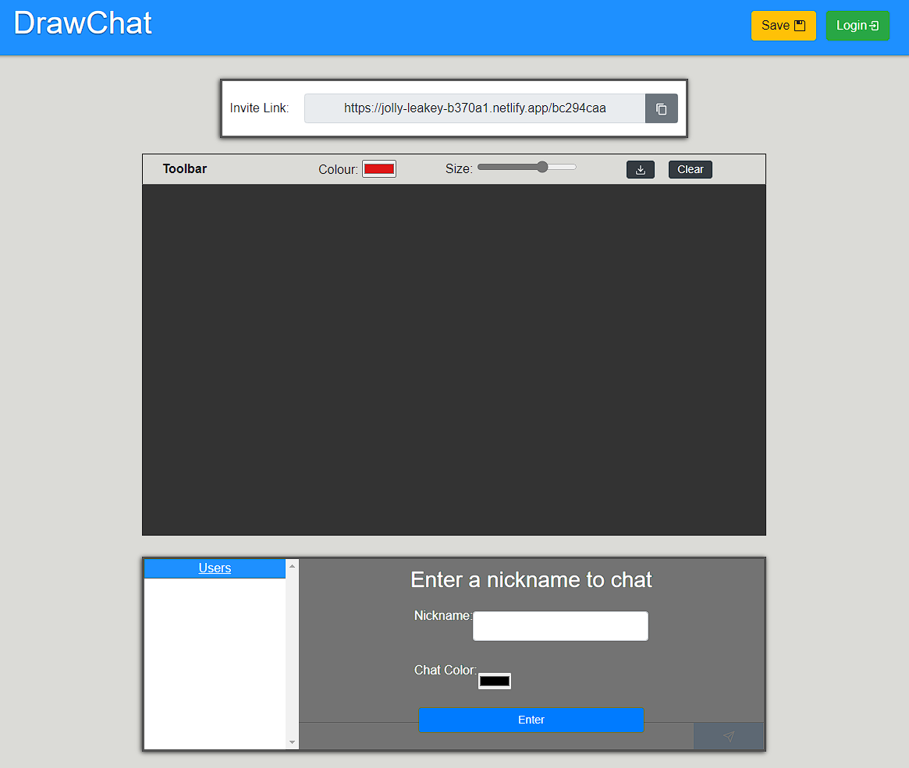

# DrawChat

## A collaborative drawing and chat project.

**! PROJECT IN DEVELOPMENT !**

[View this project LIVE here](https://jolly-leakey-b370a1.netlify.app/)

In this project you can share a link among friends and all collaboratively draw something amazing and chat at the same time. The project will also allow downloading of the drawing when complete and will provide a user area where all drawings can be saved.

Project is being built with:

- REACT
- REACT Bootstrap
- P5 JS (Canvas)
- Socket IO
- Node & Express
- Firebase (For log in & out authentication)

##### Screenshot

